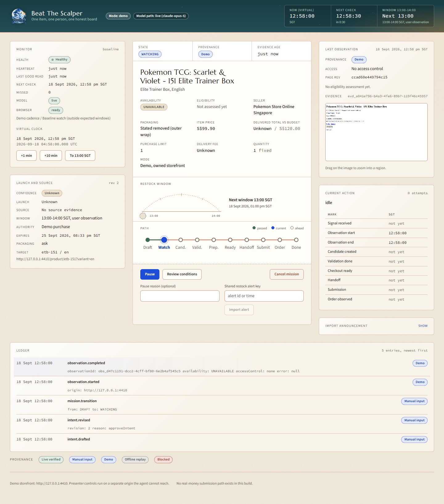

<p align="center">
  
</p>

<h1 align="center">Beat The Scalper</h1>

<p align="center">One item, one person, one honest board.</p>

---

Beat The Scalper (BTS) is a local-first assistant that helps one person buy one legitimate item from the official seller before scalpers clear it. It watches an owned demo storefront (or, behind a feasibility gate, a Lazada listing), interprets announcements and restock alerts as evidence, prepares a checkout when the offer is verified, and stops at a human handoff on real retailers.

Quantity is fixed at 1, the seller must match a first-party link, and packaging conditions and the delivered total are shown before any action. No real-money submission path exists in this codebase. A run that ends at `Unknown` and says so is an honest result, not a failure.

## The dashboard



One screen, no chat. The mission sits in the centre pocket with its state, provenance, item price, delivered total against budget, packaging condition, purchase limit, and the restock window arc. Every fact carries a provenance chip, `Unknown` is printed rather than hidden, and the ledger prints each state change with a timestamp. Captured in `demo` mode against the owned storefront under the accelerated demo clock.

## Requirements

- Node 22.13 or newer (uses `node:sqlite`). Developed on 22.17.1.
- npm 11. Dependencies are pinned exactly; `npm ci` respects the lockfile.
- Playwright Chromium: `npx playwright install chromium` once.
- Optional: `ANTHROPIC_API_KEY` in `.env` for live model interpretation. Without it the model path runs as labelled `offline_replay` from `fixtures/replay/*.json`.
- Optional: `GEMINI_API_KEY` in `.env` to use the faster `gemini-3.8-flash` path (`BTS_MODEL_PROVIDER=gemini`) instead of the Anthropic default.

## Setup

```bash
npm ci
npx playwright install chromium
cp .env.example .env        # then add ANTHROPIC_API_KEY=... if you have one
```

`.env` is gitignored. Never commit it.

## Run the demo stack

```bash
npm start
```

Starts three processes:

| Process | URL | Purpose |
|---|---|---|
| demo store | http://127.0.0.1:4310 | Owned storefront the agent may touch |
| presenter / admin | http://127.0.0.1:4311 | Restock, faults, orders. Separate origin; the agent cannot reach it |
| BTS API | http://127.0.0.1:4300 | Local API. Requires the session token printed at startup |
| dashboard | http://127.0.0.1:5173 | React UI (Vite dev server, proxies `/api/` to 4300) |

Paste the session token (also written to `data/session-token`) into the band at the top of the dashboard. A full presenter walkthrough is in [docs/demo-runbook.md](docs/demo-runbook.md).

Accelerated demo clock: set `BTS_VIRTUAL_CLOCK_START=2026-09-18T04:58:00.000Z` (12:58 Asia/Singapore) before `npm run server` to get the "+1 min / +10 min / To 13:00 SGT" controls in the Monitor pocket.

## Commands

| Command | What it does |
|---|---|
| `npm run typecheck` | `tsc --noEmit` over src, demo, tests, scripts |
| `npm test` | Vitest unit + integration suites (domain, storage, worker, agent client, browser executor, demo store HTTP and Playwright adapter) |
| `npm run test:e2e` | Playwright browser tests; boots its own stack on 4300/4310/4311/5173 with the model key blanked (offline replay) and refuses to start if those ports are busy |
| `python scripts/acceptance-status.py [--e2e]` | Stamps `fixtures/acceptance-cases.json` from executed test titles; run after the suites pass |
| `npm run demo:run` | Five measured demo runs plus fault and interruption cases; writes `docs/evaluation-results.json` and appends to `docs/evaluation-results.md` |
| `npm run smoke:fable` | Phase 0 model smoke test on the Anthropic path (live if `ANTHROPIC_API_KEY` exists, else exits 2) |
| `npm run smoke:gemini` | Same smoke test on the Gemini path (live if `GEMINI_API_KEY` exists, else exits 2) |
| `npm run eval:fable` | Extraction evaluation across effort levels on the Anthropic path; appends to a local `docs/evaluation-results.jsonl` |
| `npm run eval:gemini` | Same evaluation on the Gemini path, across thinking levels |
| `npx tsx scripts/capture-ui.ts` | Boots the stack, arms a mission, screenshots the dashboard into a local capture directory |
| `npx tsx scripts/lazada-probe.ts --url=<lazada url> --approved "<note>"` | One supervised read-only Lazada observation. Refuses to run without an approval note |
| `npm run lazada:gemini-observe -- --url=<lazada url> --approved "<note>"` | Supervised, observe-only Gemini computer-use session on one Lazada page: Gemini may scroll/screenshot only, never login/cart/buy. Requires `GEMINI_API_KEY` and an approval note; no offline replay |
| `npm run test:live:lazada` | Gated live Playwright suite for the same observe-only Gemini session, plus a single-observation run of the real Worker/scheduler against a live Lazada page. Requires `GEMINI_API_KEY` (or `ANTHROPIC_API_KEY` under `BTS_MODEL_PROVIDER=anthropic`), `BTS_LIVE_LAZADA_URL`, and `BTS_LIVE_LAZADA_APPROVED`; skips itself otherwise. Never runs under `npm run test:e2e` |
| `npm run lazada:live-reaction -- --url=<lazada url> --approved "<note>" --cadence-seconds=<int,min60> --reads=<int 1..30> [--signal-at-read=<n>] [--max-per-minute=<1..6>] [--provider=gemini\|anthropic\|none] [--sellout-seconds=60] [--human-seconds=20] [--follow-up-seconds=<n>] [--seller=<shop path>] [--format=<text>] [--language=<text>]` | Supervised, observe-only reaction measurement under the REAL Worker and scheduler (no demo store), built by `src/worker/liveObserve.ts`. Reads a live Lazada page on a fixed cadence. From the worker's event log it reports scheduler slack, observe time, the alert pipeline, mean and p95 polling reaction, and the share of restocks that would alert with `--human-seconds` left before a `--sellout-seconds` sell-out. Mission authority is `observe`, the preparation executor always refuses, and the script asserts it was never called. Requires an approval note. Refuses a live model provider with no key. `--follow-up-seconds` re-reads while in stock to time the sell-out (`restock.ended`); `--seller/--format/--language` retarget the intent for an in-stock probe of another listing |
| `npm run alert:drill -- [--count=3] [--gap-seconds=15] [--manual] [--click-url=<url>]` | Times alert delivery through `BTS_ALERT_WEBHOOK_URL` (webhook accepted, ntfy fan-out, and with `--manual` the phone showing it) and, with `--click-url`, your time from alert to Lazada's payment page. BTS loads no retailer page. Drill alerts are titled as tests |

## Layout

```
src/domain/      schemas (Zod), money, time (UTC + Asia/Singapore windows), state machine, eligibility policy, scheduling
src/storage/     node:sqlite store: missions, events, attempts, evidence, observations, settings
src/worker/      deterministic controller: scheduling, observation, validation, preparation, submission boundaries, reconciliation
src/adapters/    demo store Playwright adapter/executor (origin allowlisted); Lazada adapter blocked by the feasibility gate
src/agent/       Anthropic SDK client (history integrity, structured output, offline replay), restricted browser toolset, extraction, assessment
src/server/      local HTTP API (token + Origin checks), wiring, entry point
src/ui/          React dashboard, "Binder Page" design
demo/store/      owned storefront + presenter/admin origin with faults
prompts/         runtime prompts for extraction and assessment
fixtures/        acceptance cases, reference alert screenshot and notes, offline replay fixtures
scripts/         smoke, eval, demo runs, UI capture, Lazada probe
tests/           unit, integration (HTTP + Playwright), e2e
docs/            feasibility record, runbook, screenshots, evaluation results
```

Scope, audiences, and brand commitments are in [PRODUCT.md](PRODUCT.md); the design system as shipped is recorded in [DESIGN.md](DESIGN.md). The acceptance checklist is [fixtures/acceptance-cases.json](fixtures/acceptance-cases.json), cases A01-A26; it lists what must pass, not what has passed.

## Modes and gates

- `demo`: full simulated purchase on the owned storefront through a real Chromium. Quantity is fixed at 1, the seller must match, packaging conditions are surfaced before any action, and the delivered total shows `Unknown` until delivery is known.
- `lazada_assist`: missions can be drafted and armed; live observation stays `Blocked` until [docs/lazada-feasibility.md](docs/lazada-feasibility.md) records a passed continuous-observation test and the user sets a reviewed cadence. The live path ends at human handoff. Every live access needs explicit approval first.
- The model interprets evidence only. The deterministic controller owns observation, policy, and execution; model output can resolve an unknown into a concrete condition that code re-checks, never authorise a purchase.

### Restock alerts

Restocks typically sell out within a minute, and on live retailers the user buys. When an observation turns AVAILABLE, the worker alerts immediately from deterministic checks, before any model call. The alert goes to the terminal bell, the dashboard banner and a desktop notification. If `BTS_ALERT_WEBHOOK_URL` is set (for example an ntfy topic that reaches a phone), it is also POSTed there. Checks still unknown at that instant, such as the delivered total, are listed as "check before paying". A definite mismatch (wrong seller, format or language, or an item price alone over budget) suppresses the alert. A mismatch that validation finds later sends a retraction. An artwork-only packaging notice is read by the model in the background while the item is out of stock and cached, so a restock never waits on the model.

### Model providers

`BTS_MODEL_PROVIDER` selects the live model path: `anthropic` (default, `claude-opus-5`) or `gemini` (`gemini-3.8-flash`, a faster/cheaper alternative, thinking level `low` by default). Both implement the same `FableClient` contract, so `extractAnnouncement` and `FableOfferInterpreter` behave identically either way, and both fall back to the same labelled `offline_replay` fixtures when their provider's key is absent. The Gemini path only supports single-turn, tool-free requests: it does not run the restricted browser toolset, so any task carrying `tools` or a `browserExecutor` (the gated `lazada_observe` assessment path) is refused before any network call with a message to switch back to `BTS_MODEL_PROVIDER=anthropic`. Gemini interactions are never stored server-side (`store: false` on every call).

The Gemini path additionally offers a supervised, observe-only computer-use observation (`scripts/lazada-gemini-observe.ts`) that lets Gemini scroll and screenshot a live Lazada page to produce a structured report. Click/type/navigate and every other interactive predefined function are excluded from the served tool and rejected again in code if the model attempts one anyway; it is not wired into the worker.

Reaction speed is no longer measured against the demo store: it is measured live against Lazada, under the real `Worker` and real scheduler, in a supervised, approval-gated, observe-only harness (`npm run lazada:live-reaction`, `tests/live/lazada-reaction.spec.ts`); the file-based live gate above is unchanged by this -- `BTS_LIVE_OBSERVE_ENABLED`/`BTS_LIVE_PREPARE_ENABLED` stay `false` by default and these harnesses set the feasibility pass in their own throwaway in-memory store only.

## Provenance labels

Every fact on screen carries one of five labels, and a mocked or replayed result is never presented as live:

| Label | Meaning |
|---|---|
| `live_verified` | Read from the real retailer during an approved access |
| `manual_input` | Pasted text, an imported screenshot, or a shared alert |
| `demo` | Produced by the owned local storefront |
| `offline_replay` | Produced from recorded fixtures with no model call |
| `blocked` | The step was refused, gated, or unreachable |

Money is stored in integer minor units (SGD). Instants are stored in UTC and displayed in Asia/Singapore. The 13:00-14:00 SGT restock window is a user observation, not a fact about the retailer.

## Security notes

- API writes require `X-BTS-Token` (random per boot, tab-scoped in the UI) and an allowed `Origin`. No wildcard CORS.
- Event payloads are redacted for credential-like keys before persistence.
- The demo executor aborts any request to a non-store origin at the network layer. The presenter origin is never reachable from the agent.
- The repository ships no credentials, API key, browser profile, or payment data.

## Built with Claude

BTS was designed and implemented with [Claude Code](https://claude.com/claude-code). The Anthropic model configured in `.env` also runs inside the product, where its only job is interpreting evidence: extracting facts from announcements and screenshots, and assessing whether an offer matches the mission. It never drives the browser, the policy, or a purchase.

## License

[MIT](LICENSE).

Pokemon and Pokemon Center are trademarks of their respective owners. This project is unaffiliated with them, with Lazada, and with any retailer. The storefront in `demo/store` is an owned local simulation written for this repository.
